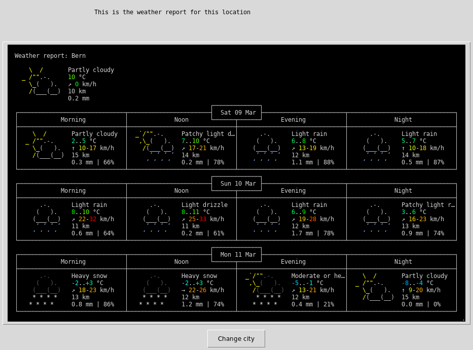
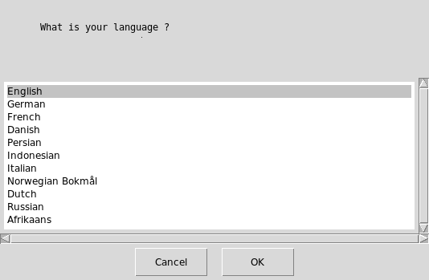
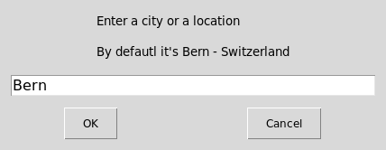

 [](https://github.com/psf/black)   

# Weather Meteo in Python 3





## What's this software ?  

This python 3 software show you a weather report. 
It use https://wttr.in/ look at https://wttr.in/:help for more information about it.


## Download the Windows .exe version :

You can run it with Python 3 and the right libraries or for Windows you can use the .exe software that I created there :

[](https://sourceforge.net/projects/weather-meteo-worldwide/files/latest/download)
[](https://sourceforge.net/projects/weather-meteo-worldwide/files/latest/download)


## Language selection



## Enter a location



## What you need to make it work :  

The last version of Python 3.

you also need to have the easygui library for python 3:

At least the version 0.98

```sh
sudo python3 -m pip install --upgrade easygui 
```
You need wget for python 3:


```sh
sudo pip3 install wget
```

You need unidecode for python 3:


```sh
sudo pip3 install unidecode
```

## How to launch this software :  

```sh
python3 meteo.py
```  

## Requirements :

If you miss a module, install it pip install module-name.

Your user must have read and write access on the current running 
directory.

## Developer - Author

Hamdy Abou El Anein

## Homepage

http://www.daylightlinux.ch 
